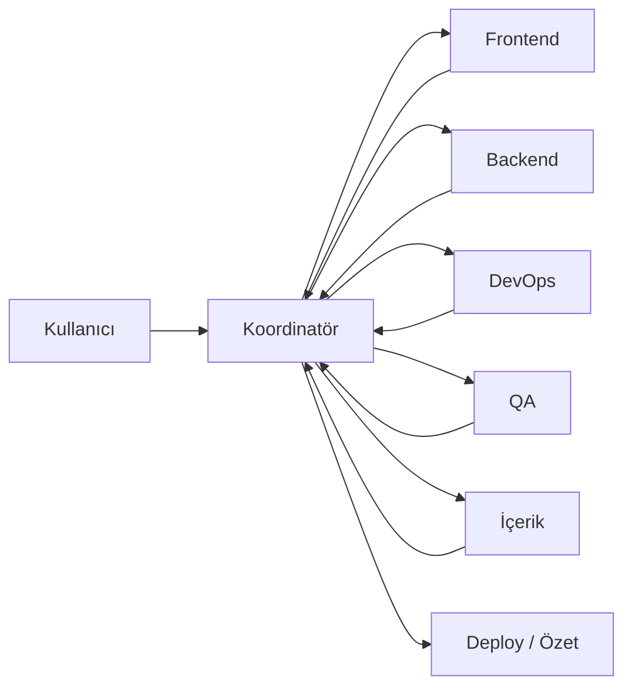

# ProMedia Agent Ekibi

Bu dosya **iç ekip koordinasyonu** içindir. Cursor'da her rol ayrı agent oturumunda veya paralel Task ile çalıştırılır.

## Nasıl kullanılır

```bash
# Durum tara + görev dağıt
npm run team:status

# Sadece sağlık kontrolü
npm run health

# Cursor'da koordinatör başlat
"AGENT_TEAM.md oku, team:status çalıştır, her role görev ver"
```

Paralel çalıştırma (Cursor Agent içinde):

```
AGENT_TEAM.md'deki 5 role göre paralel Task başlat — her biri kendi görevini yapsın
```

---

## Ekip yapısı

| Rol | Kod | Model önerisi | Sorumluluk |
|-----|-----|---------------|------------|
| **Koordinatör** | `coord` | composer-2.5-fast | Görev dağıtımı, öncelik, özet |
| **Frontend** | `ui` | gemini-3.5-flash | Sayfa, bileşen, tasarım, UX |
| **Backend** | `api` | gpt-5.3-codex-high-fast | API, auth, DB, SMM, sipariş |
| **DevOps** | `ops` | composer-2.5-fast | Vercel, env, Turso, deploy |
| **QA** | `qa` | gemini-3.5-flash | Health bot, route test, regresyon |
| **İçerik/SEO** | `content` | claude-4.6-sonnet-medium-thinking | Katalog, metin, FAQ, blog |

---

## Rol talimatları (kopyala-yapıştır)

### 1. Koordinatör (`coord`)

```
ProMedia koordinatörüsün. /home/bypro20/promedia
1. npm run team:status çalıştır
2. AGENT_TASKS.md'deki pending görevleri rollere böl
3. Blocker varsa raporla (Google redirect URI, SMM key vb.)
4. Diğer agent'ların çıktısını birleştirip kullanıcıya özet ver
Sadece koordine et — kod yazma unless blocker fix 5 satırdan kısaysa.
```

### 2. Frontend (`ui`)

```
ProMedia frontend agent'ısın. /home/bypro20/promedia
- src/components/, src/app/(marketing)/, globals.css
- SosyalDigital tarzı UI, overflow fix, mobil
- Giriş/kayit/panel görünümü
AGENT_TASKS.md'de ui etiketli görevleri yap. Build kırma.
```

### 3. Backend (`api`)

```
ProMedia backend agent'ısın. /home/bypro20/promedia
- src/app/api/, src/lib/auth.ts, prisma, SMM entegrasyonu
- Sipariş, wallet, admin API
AGENT_TASKS.md'de api etiketli görevleri yap.
```

### 4. DevOps (`ops`)

```
ProMedia DevOps agent'ısın. /home/bypro20/promedia
- Vercel deploy, env vars, Turso DB
- GitHub push, build cache, production URL
AGENT_TASKS.md'de ops etiketli görevleri yap. Secret'ları chat'e yazma.
```

### 5. QA (`qa`)

```
ProMedia QA agent'ısın. /home/bypro20/promedia
- npm run health (SITE_URL=https://promedia-kappa.vercel.app)
- /giris, /panel, /admin, sipariş API smoke test
- Kırık route ve 500'leri raporla, düzeltme öner
AGENT_TASKS.md'de qa etiketli görevleri yap.
```

### 6. İçerik (`content`)

```
ProMedia içerik agent'ısın. /home/bypro20/promedia
- src/lib/catalog.ts, packages, FAQ, SEO metinleri
- Eksik platform/hizmet sayfaları
AGENT_TASKS.md'de content etiketli görevleri yap.
```

---

## İş akışı



---

## Kurallar

1. **Paralel:** Birbirine bağlı olmayan görevler aynı anda farklı agent'lara verilir.
2. **Sıralı:** Deploy (ops) → QA doğrulaması → koordinatör özeti.
3. **Tek kaynak:** Görev listesi `AGENT_TASKS.md`; durum `npm run team:status`.
4. **Canlı URL:** `https://promedia-kappa.vercel.app`
5. **Commit:** Sadece koordinatör veya kullanıcı isteğiyle.

---

## Hızlı komutlar

| Komut | Ne yapar |
|-------|----------|
| `npm run team:status` | Ekip durumu + görev özeti |
| `npm run health` | Route sağlık kontrolü |
| `npm run team:dispatch` | Rollere JSON görev çıktısı |
